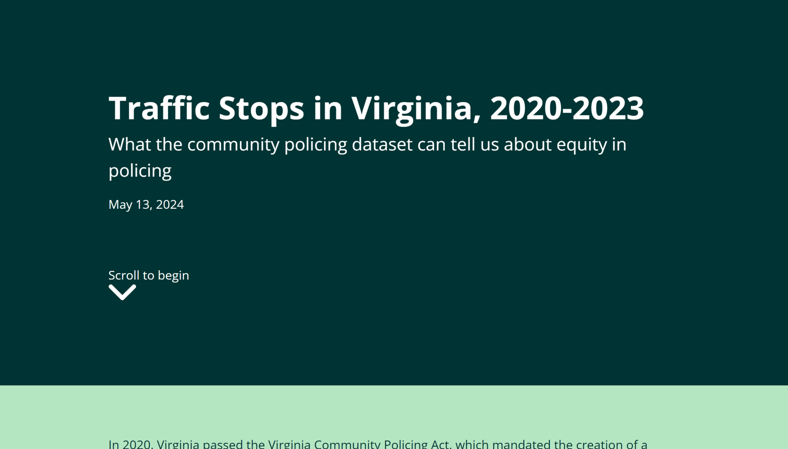

# Visualizing traffic stop data

I will use the Virginia Community Policing Dataset to analyze data collected during traffic stops be
tween 2020-2023. This dataset was aggregated by Virginia State Police in response to a 2020 state law
mandating traffic stop reporting.
 
 The data can be downloaded as a CSV file from the [Virginia Open Data Portal](https://data.virginia.gov/dataset/community-policing-data).
 
 Broadly, I want to know what the new traffic stop reporting/data collection requirements tell us
 about policing outcomes by demographic groups in Virginia. View the live link [here](https://sdinesh01.github.io/traffic-stops-va/). 
 
 The questions I aim to answer include:
 
 1. How have traffic stop counts changed per district by year? 
 2. What is the relationship between the race of a driver and the action taken by officers? 
 3. What jurisdictions are outliers in making arrests and using force during traffic stops? (TO ADD)
 4. What police jurisdictions have the highest number of traffic stops? (TO ADD)

## Open locally

**You will need to have Node.js installed**

1. clone the repo
2. run `npm install` in the directory
3. To develop the website on a local server: `npm run dev`
4. Deploy: `npm run build`
